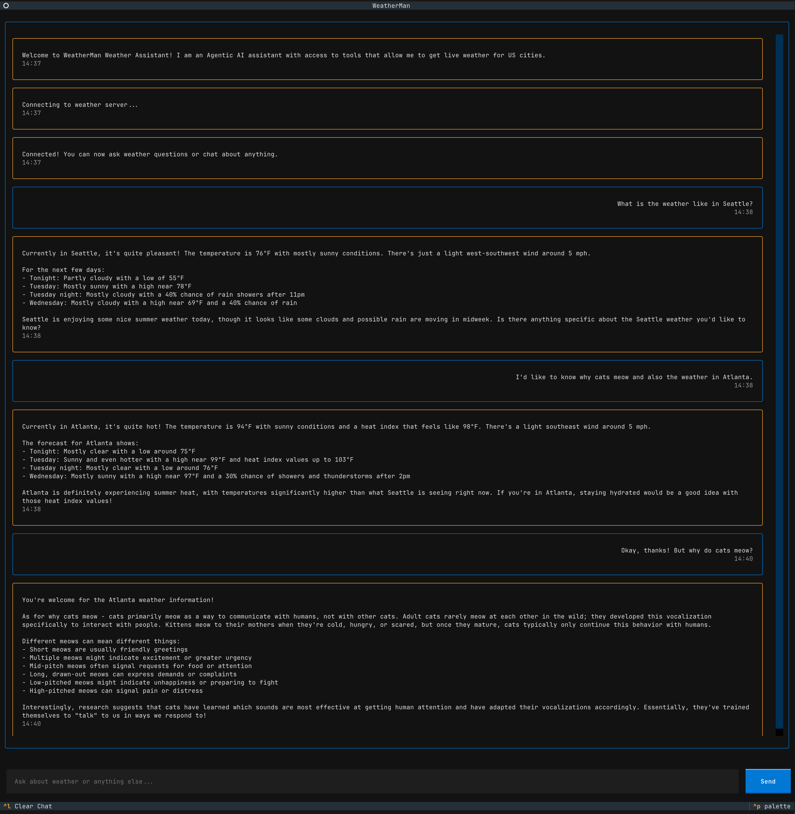

# WeatherMan 🌤️

WeatherMan is an agentic AI assistant that provides live weather data for US cities using the weather.gov API. It features a modern terminal UI powered by Textual and acts as both a weather tool and general AI chat assistant.



## Features

- 🌦️ Real-time weather forecasts and alerts for US locations
- 💬 General AI chat capabilities powered by Claude
- 🖥️ Modern terminal UI that feels like a chat app
- 🚀 Built with Python and Textual

## Requirements

- Python 3.8 or later
- Anthropic API key
- uv package manager

## Setup & Run

1. Clone this repository
2. Install uv: `pip install uv`
3. Create a `.env` file with your Anthropic API key:
```
ANTHROPIC_API_KEY=your_api_key_here
```
4. Install dependencies: `uv sync`
5. Run the app: `python weather_man.py`

Use `Ctrl+C` to quit or `Ctrl+L` to clear the chat history.
